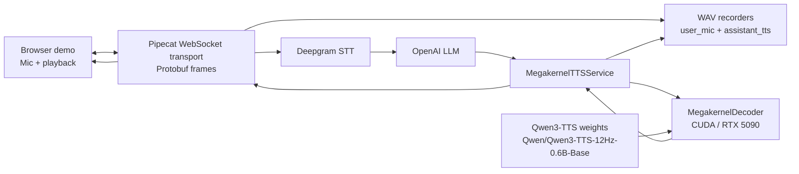
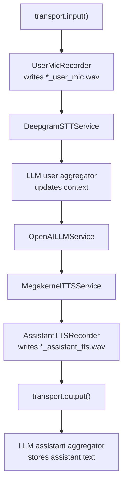
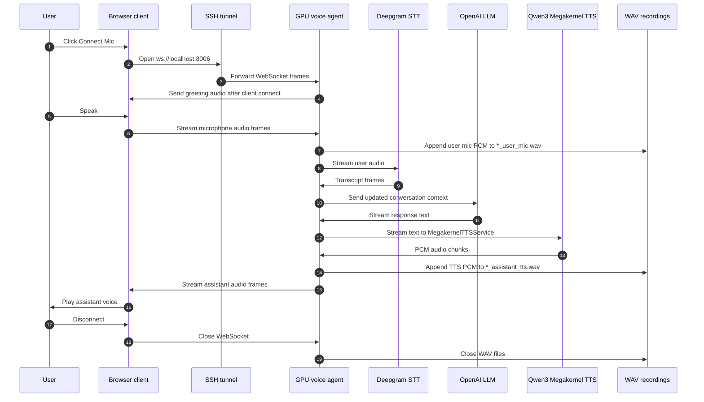
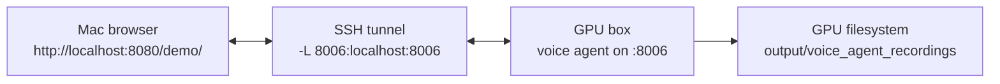

# Architecture

This project wraps Qwen3-TTS with a CUDA megakernel decoder and exposes it through
three surfaces:

- A FastAPI TTS endpoint for request/response WAV generation.
- A Pipecat `MegakernelTTSService` for streaming TTS frames.
- A WebSocket voice-agent demo that chains browser audio, STT, LLM, TTS, playback,
  and WAV recording.

For the complete configuration matrix, see [options.md](options.md).

## Components



## Voice-Agent Pipeline

`demo/live_voice_agent.py` builds one Pipecat pipeline. Audio enters through the
WebSocket input transport as browser microphone frames. The pipeline records the
raw user audio, transcribes it, feeds the transcript into the LLM context, streams
the LLM response into Qwen3-TTS, records the generated assistant audio, then sends
that audio back to the browser.



## Execution Flow



## Startup Path

1. `main()` validates `DEEPGRAM_API_KEY` and `OPENAI_API_KEY`.
2. `_configure_gpu()` requires CUDA, selects device `0`, and sets
   `MEGAKERNEL_TTS_MODE=real` by default.
3. `MegakernelTTSService` initializes `MegakernelDecoder` with the Qwen3-TTS model.
4. `tts.decoder.initialize()` loads model weights and warms up the CUDA path.
5. `WebsocketServerTransport` starts with protobuf serialization and browser audio
   input/output enabled.
6. `PipelineRunner` runs the Pipecat task until the browser disconnects.

## Recording Behavior

The voice-agent demo records live sessions on the GPU server. By default, files
are written under:

```text
output/voice_agent_recordings/
```

Each run uses a UTC timestamp prefix:

```text
YYYYMMDDTHHMMSSZ_user_mic.wav
YYYYMMDDTHHMMSSZ_assistant_tts.wav
```

Use `--record-dir` to override the destination:

```bash
python demo/live_voice_agent.py --port 8006 --host 0.0.0.0 \
  --record-dir output/my_demo_recordings
```

## Local Demo Topology

When the agent runs on a remote GPU box and the browser runs on a Mac, the common
setup is:



Run the tunnel from the Mac:

```bash
ssh -p 51848 root@79.117.32.66 -L 8006:localhost:8006
```

Then open the local browser client at `http://localhost:8080/demo/` and connect
to `ws://localhost:8006`.
